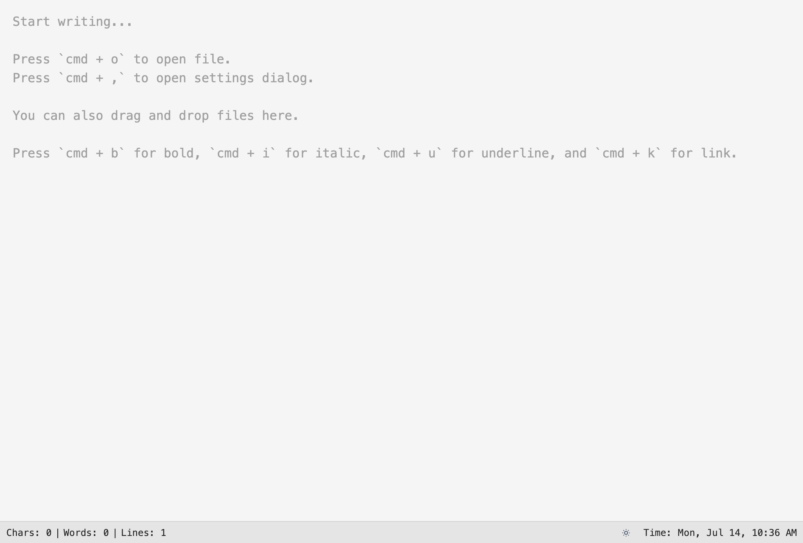
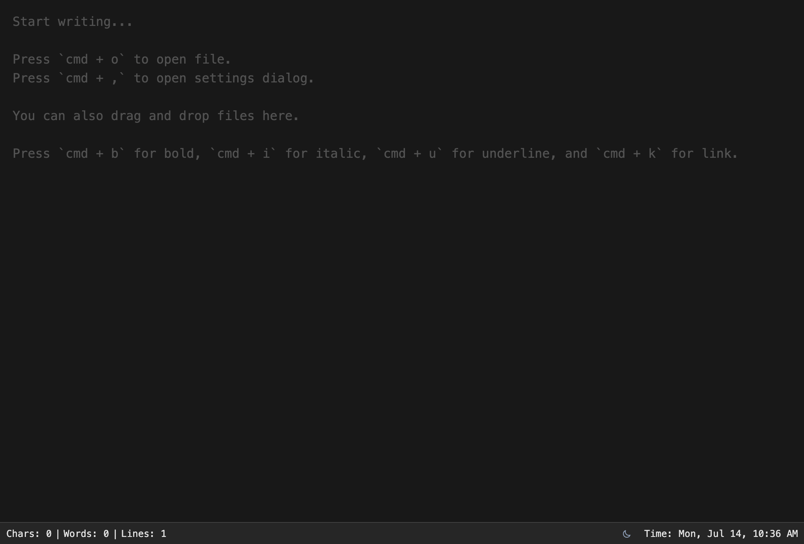

# Text Editor

A clean, simple, and powerful web-based text editor built with Vue 3, TypeScript, and Tailwind CSS. Perfect for quick note-taking, writing, and editing various file formats directly in your browser.

## ✨ Features

- **📝 Rich Text Editing**: Clean, distraction-free writing experience with a monospace font
- **🌓 Dark/Light Mode**: Toggle between themes or use system default
- **📊 Real-time Stats**: Live character, word, and line counting
- **📁 File Support**: Drag & drop files or open with keyboard shortcuts
- **⌨️ Keyboard Shortcuts**: Efficient text formatting and file operations
- **🎨 Syntax Detection**: Automatic language detection for code highlighting
- **💾 Auto-save**: Content automatically persists in local storage
- **⚙️ Customizable**: Adjustable font size and theme preferences
- **📱 Responsive**: Works great on desktop and mobile devices

## 🚀 Demo

**Live Demo**: [https://text.msar.me](https://text.msar.me)




## 🔧 Installation

1. Clone the repository:
```bash
git clone https://github.com/4msar/text-editor.git
cd text-editor
```

2. Install dependencies:
```bash
npm install
# or
yarn install
```

3. Start the development server:
```bash
npm run dev
# or
yarn dev
```

4. Open your browser and visit `http://localhost:5173`

## 📖 Usage

### Basic Editing
- Start typing in the main text area
- Your content is automatically saved to local storage
- Use the status bar to monitor character, word, and line counts

### File Operations
- **Open File**: Press `Ctrl+O` (or `Cmd+O` on Mac) to browse and open a file
- **Drag & Drop**: Simply drag a file from your computer into the editor
- **Supported Formats**: Text files, Markdown, JSON, JavaScript, TypeScript, HTML, CSS, Vue, and many more

### Keyboard Shortcuts
- `Ctrl+O` / `Cmd+O` - Open file
- `Ctrl+,` / `Cmd+,` - Open settings
- `Ctrl+B` / `Cmd+B` - Bold text
- `Ctrl+I` / `Cmd+I` - Italic text
- `Ctrl+U` / `Cmd+U` - Underline text
- `Ctrl+K` / `Cmd+K` - Insert link

### Settings
Press `Ctrl+,` (or `Cmd+,` on Mac) to access settings:
- **Theme**: Choose between Light, Dark, or System Default
- **Font Size**: Adjust the editor font size for comfortable reading

## 🎯 Supported File Types

The editor supports a wide range of file formats including:

**Text & Documentation**: `.txt`, `.md`, `.csv`, `.log`  
**Web Technologies**: `.html`, `.css`, `.scss`, `.sass`, `.less`, `.js`, `.ts`, `.jsx`, `.tsx`, `.vue`  
**Programming Languages**: `.py`, `.java`, `.cpp`, `.c`, `.h`, `.php`, `.rb`, `.go`, `.rs`, `.swift`, `.kt`  
**Data & Config**: `.json`, `.xml`, `.yaml`, `.yml`, `.ini`, `.cfg`, `.conf`, `.env`, `.toml`  
**And many more...**

## 🛠️ Development

### Build for Production
```bash
npm run build
# or
yarn build
```

### Preview Production Build
```bash
npm run preview
# or
yarn preview
```

### Tech Stack
- **Framework**: Vue 3 with Composition API
- **Language**: TypeScript
- **Styling**: Tailwind CSS
- **Build Tool**: Vite
- **State Management**: VueUse (for localStorage and utilities)

## 🤝 Contributing

Contributions are welcome! Please feel free to submit a Pull Request.

## 📄 License

This project is open source. Please check with the repository owner for license details.

## 👨‍💻 Author

**Saiful Alam Rakib** - [@4msar](https://github.com/4msar)

---

**🌟 Star this repository if you find it helpful!**
